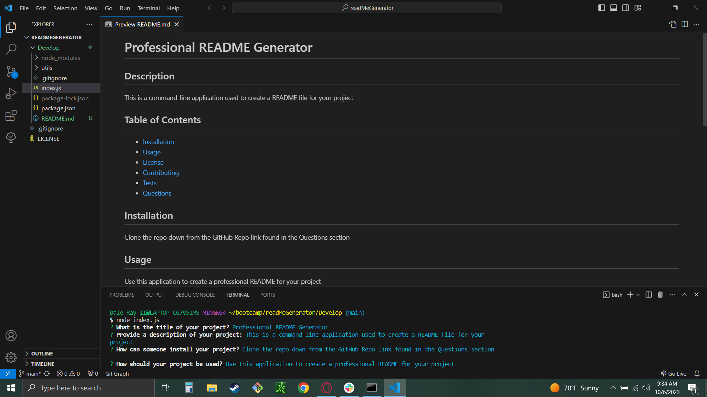

# Professional README Generator

## Description
This is a command-line application used to create a README file for your project

## Table of Contents
- [Installation](#installation)
- [Usage](#usage)
- [License](#license)
- [Contributing](#contributing)
- [Tests](#tests)
- [Questions](#questions)

## Installation
Clone the repo down from the GitHub Repo link found in the Questions section

## Usage
Use this application to create a professional README for your project

## License

## Contributing
See install instructions. Open a pull request for any desired changes.

## Tests
See install instructions. Run application.

## Questions
For any questions or feedback, please feel free to contact me at daleray1231@gmail.com.

You can also reach out to me on [GitHub](https://github.com/daleray1231).

## Demo
https://share.vidyard.com/watch/DVyR9KAMBtuCinkYphdHgh?
